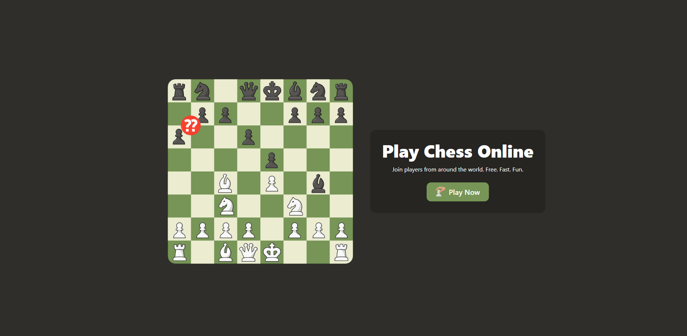
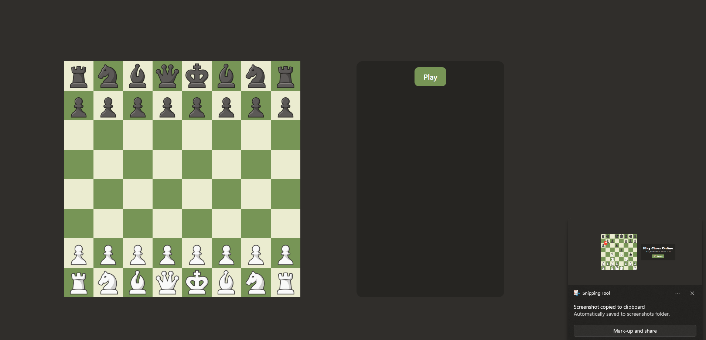

# Chess Game

A real-time multiplayer chess game built with a React frontend and a Node.js WebSocket backend.

## Features

- Real-time multiplayer chess gameplay
- Interactive chessboard with drag-and-drop moves
- Game state management via WebSocket
- Responsive design with TailwindCSS

## Architecture

### Backend (`backend1/`)
- Built with Node.js and TypeScript
- Uses WebSocket for real-time communication
- Integrates `chess.js` for game logic and validation
- Manages game rooms and player connections

### Frontend (`frontend/`)
- React application built with Vite
- Uses `chess.js` for client-side game logic
- TailwindCSS for styling
- WebSocket integration for real-time updates

## Screenshots





## Demo Video

<video width="640" height="480" controls>
  <source src="Chess/Chess.mp4" type="video/mp4">
  Your browser does not support the video tag.
</video>

## Getting Started

### Prerequisites
- Node.js
- npm or yarn

### Running the Backend
```bash
cd backend1
npm install
npm run dev
```

### Running the Frontend
```bash
cd frontend
npm install
npm run dev
```

Open your browser to `http://localhost:5173` (or the port Vite assigns) to play the game.

## Technologies Used
- **Frontend**: React, TypeScript, Vite, TailwindCSS, chess.js
- **Backend**: Node.js, TypeScript, WebSocket, chess.js